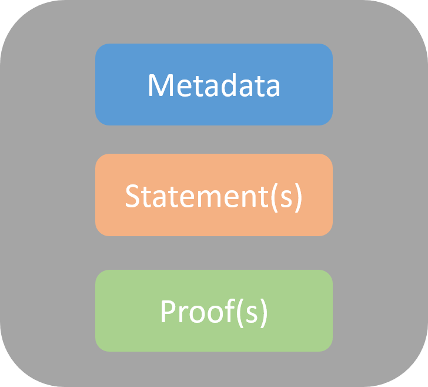

改进后：


- 同时支持链上/链下存储，默认链下
- 通过支持加密证书的颁发以支持部分暴露


## did

用native合约来实现，接口如下：

```
addDID(NeoID,publickey)                //调用成功后链上自动生成该did对应的DID doccument，且该公钥与该did绑定。需提供参数中的公钥对应私钥的签名。
deleteDID(NeoID,publickey)             //调用成功后该did对应的DID doccument清空。需提供参数中的公钥对应私钥的签名。
updateKey(NeoID,publickey)             //更新公钥，可为空，为空之后该DID不可用。需提供所有者的签名。
setRecovery(NeoID,recovery,threhold)   //设置/修改恢复人，需提供所有者的签名
updateKeyByRecovery(NeoID,publickey)   //恢复人恢复公钥，需提供恢复人的签名
getDDO(NeoID)                          //获取DID doccument
setAttribute(NeoID,attribute,value)    //在DID doccument中增加/修改其他属性，需提供所有者的签名

```


## claim

支持明文claim的颁发，加密claim和部分加密claim的颁发。每个claim结构如图：




Metadata需要包含的字段如下：

|属性|描述|
|------|------|
|@context|用来描述claim中出现的每个术语的schema|
|type|claim类型|
|claimId|claim的编号，可唯一标识该claim
|issuer|颁发者的ID
|issuanceDate|颁发日期
|Subject|claim的主体
|claimSchema|issuer发布的claim模板，非必需
|validFrom|生效开始日期，非必需
|validUntil|生效截止日期，非必需

一个claim由若干条statement组成。每个statement需要包含的字段如下：

|属性|描述|
|------|------|
|key|键|
|type|类型，有两种：可以是plain(明文)，也可以是proof(加密后的结果)|
|value|值|
|encryptionArithmetic|加密算法，如果type字段为proof,则该字段为必需，否则不需要|
|parameter|密钥对应的参数，可以是salt，也可以是种子，根据加密算法而定；如果type字段为proof，则该字段为必需，否则不需要|


proof指数字签名，支持单个文档中的多个证明。示例如下：

```
{
    ...
    "proof": {
        "type": "Ed25519Signature2018",
        "proofPurpose": "assertionMethod",
        "created": "2017-09-23T20:21:34Z",
        "verificationMethod": "did:example:123456#key1",
        "jws": "eyJ0eXAiOiJK...gFWFOEjXk"
    }
}
```


### claim颁发

issuer在颁发加密证书时，可根据用户的加密策略隐藏不想被人知道的value。NEO支持不同的隐藏策略，比如哈希，加密。

在使用哈希策略时，可以将value哈希后的值填入stamentment的value项。注意，哈希策略只适用于值域很大且不固定的情况，否则很容易被破解。

使用加密方法时，issuer需要和holder共享一个claim_key，claim_key由holder生成，不可复用，一个证书对应一个claim_key。该claim_key只有issuer和holder两个人知道。使用该claim_key派生出每条statement的statement_key，使用派生出的statement_key对该条statement的值对称加密。salt由issuer来随机生成指定（issuer的密钥派生可采用[HKDF](https://tools.ietf.org/html/rfc5869)来实现）。且issuer在颁发完证书后，是默认不保存claim_key的。

因为每一个holder可能有很多claim，为了避免holder重复设置很多密码，holder亦可使用派生密钥的方法，用privateKey来派生claim_key。

用户在收到issuer颁发的证书时，需要根据每一条statement中的encryptionArithmetic和parameter，恢复密文，验证证书是否无误。


### claim存储

同时支持链上存储和链下存储，可根据应用场景选择不同的存储策略，默认链下存储。

链上支持明文存储和加密存储，holder在收到claim后，可以自行将其存储于合约，NFS等，不做具体限制。链上加密存储时，任何人只要知道存储地址都可以拿到claim秘文，但是不能解密。

### claim出示

链下claim的出示在链下进行，holder直接发送给verifier。

链上claim的出示即为向verifier发送claim存储地址（非加密存储）或者claim存储地址+密钥（加密存储）的过程。


### 部分暴露

无论是链上存储还是链下存储，如果有部分暴露的需求，则必须使用加密证书。在出示claim时，holder根据statement的隐藏策略，同时向verifier发送加密证书的需暴露statement的statement_key或者明文，则verifer可验证这部分属性。
