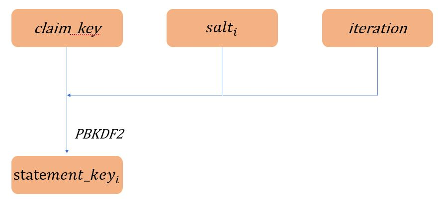

改进后：


- 同时支持链上/链下存储
- 支持部分暴露


## claim

支持明文claim的颁发，加密claim和部分加密claim的颁发。每个claim结构如图：


Metadata需要包含的字段如下：

|属性|描述|
|------|------|
|@context|用来描述claim中出现的每个术语的schema|
|type|claim类型|
|claimId|claim的编号，可唯一标识该claim
|issuer|颁发者的ID
|issuanceDate|颁发日期
|Subject|claim的主体
|claimSchema|issuer发布的claim模板，非必需
|validFrom|生效开始日期，非必需
|validUntil|生效截止日期，非必需

一个claim由若干条statement组成。每个statement需要包含的字段如下：

|属性|描述|
|------|------|
|key|键|
|value|值，可以是明文，也可以是加密后的结果|
|encryptionMethod|加密算法，如果该字段加密则为必需，否则不需要
|salt|密钥对应的盐，如果该字段加密则为必需，否则不需要
|iteration|派生密钥的迭代次数，如果该字段加密则为必需，否则不需要

proof--略

## claim颁发

issuer在颁发加密证书时，需要和holder共享一个claim_key，claim_key由holder生成，不可复用，一个证书对应一个claim_key。该claim_key只有issuer和holder两个人知道。使用该claim_key派生出每条statement的statement_key，使用派生出的statement_key对该条statement的值对称加密。salt和iteration由issuer来指定（issuer的密钥派生采用PBKDF2来实现），需要注意的是，对于一个证书，issuer在为该证书生成salt时，salt不能重复。且issuer在颁发完证书后，是默认不保存claim_key的。

用户在收到issuer颁发的证书时，需要根据每一条statement中的salt和iteration结合该证书的claim_key恢复每一个statement_key，解密密文，验证证书是否无误。

为了避免holder重复设置很多密码，holder亦可使用派生密钥的方法，用privateKey来派生claim_key，同样需要保证salt不重复，进而该用户的每一个证书的claim_key不重复。

密钥派生使用PBKDF2算法。





## claim存储

同时支持链上存储和链下存储，可根据应用场景选择不同的存储策略,默认链下存储。

链上支持明文存储和加密存储，加密存储时，任何人都可以拿到秘文，但是不能解密。

## claim出示

链下claim的出示在链下进行，holder直接发送给verifier。

链上claim的出示即为向verifier发送hash/claimId（非加密存储）或者hash/claimId+密钥（加密存储）的过程。


## 部分暴露

无论是链上存储还是链下存储，如果有部分暴漏的需求，则必需使用加密证书。在出示claim时，holder同时向verifier发送加密证书的需暴露statement的statement_key，则verifer可解密这部分属性。


## issuer合约接口

```
issueClaim(claimId)//只有issuer可以调用
revokeClaim(claimId)//只有issuer可以调用
storeClaim(claim)//只有holder可以调用,会检查claimId是否在该issuer颁发的claim列表中，且是否为该issuer签名，不在则存储失败
storeEncryptedClaim(claim)//任何人可以调用，无需检查。调用成功，issuer会返回一个索引值i，holder/verifier可以用该值来检索获取claim。
getclaim(claimId)//根据claimId获取存储上链的claim
getEncryptedClaim(i)//根据索引值i获取存储上链的Encryptedclaim
getclaimSchema(schemaId)//根据schemaId获取schema
isvalid(claimId)//查询该claimId是否为该issue所颁发且是否吊销
```


